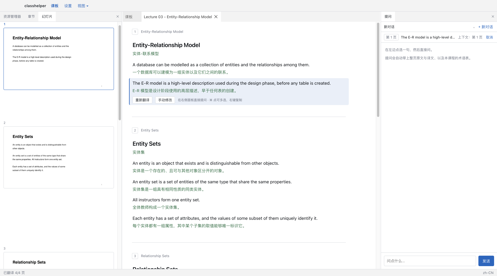
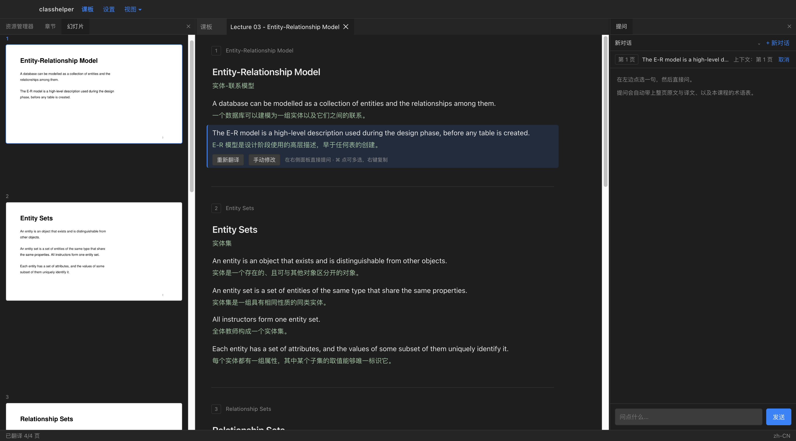
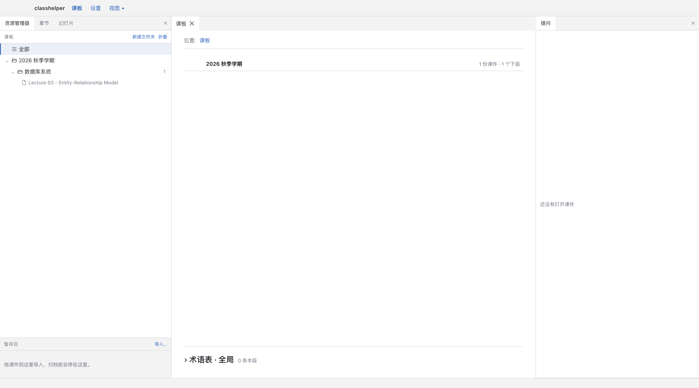

<div align="center">

# ClassHelper

**英文课件逐句翻译成中文，看不懂的地方直接问 AI。**

[](https://github.com/ahpasserby/ClassHelper)
[](LICENSE)
[](https://github.com/ahpasserby/ClassHelper/releases)
[](https://github.com/ahpasserby/ClassHelper/releases/latest)

简体中文 | [English](README.en.md)

</div>

---

支持 `.pptx`、`.ppt`、`.pdf`、`.docx`、`.md`。每句英文下面跟着它的中文，原文和译文一一对应。



## 功能

- **逐句对照**：整页作为上下文翻译，术语在整份课件里保持一致。代码、公式、专有名词不动。
- **原图并排**：左边幻灯片原图，右边译文，滚动同步，页与页对齐。
- **选中提问**：选一句或多句直接问，问题自动带上整页原文、译文和课程术语表。
- **三种复制**：右键选中的句子，可以只复制原文、只复制译文，或两者对照。
- **术语表**：锁定一个词的译法，所有用到它的句子会重新翻译。分全局 / 学期 / 课程三级。
- **课板**：按学期和课程整理课件，就是真实的文件夹。在访达里改动，程序两秒内同步。
- **其他资料照常显示**：课程文件夹里的大纲、数据集、代码压缩包也会列在课板上，标着格式、可以归档，只是打不开时会直说。
- **费用**：状态栏显示累计花费（人民币），单价从服务商价目页自动获取。
- **缓存**：翻译过的内容存在课件同级目录，重新打开是即时的，也不再花钱。

<div align="center">


</div>

## 安装

到 [Releases](https://github.com/ahpasserby/ClassHelper/releases/latest) 下载
`ClassHelper-*-mac-arm64.dmg`，打开后把应用拖进「应用程序」。

目前只有 macOS（Apple Silicon）版本。应用做了 ad-hoc 签名但没有 Apple 公证，第一次
打开系统会拦一下。**最省事的办法**是在终端执行一次：

```bash
xattr -dr com.apple.quarantine /Applications/ClassHelper.app
```

也可以先双击打开、被拦下后去「系统设置 → 隐私与安全性」，在底部点「仍要打开」。

## 配置

第一次启动进「设置」，填一个 API key 就能用。默认用 DeepSeek，翻译一份课件几毛钱。

| 项 | 说明 |
| --- | --- |
| 服务商 | DeepSeek、OpenAI、Moonshot、硅基流动、Ollama，或任何 OpenAI 兼容接口 |
| 翻译模型 | 调用量大，用便宜的 |
| 提问模型 | 一次一问，可以用贵一点的推理模型 |
| 目标语言 | 默认 `zh-CN`，可改成 `en`、`ja` 等 |
| 用户信息位置 | 课件、术语表、缓存都在这个目录下，可整体备份 |

`.ppt` 需要 LibreOffice 才能读；`.pptx` 和 `.docx` 装了它才能显示真正的原版排版：

```bash
brew install --cask libreoffice
```

`.pptx` 没装也能用，这时显示的是按原版式还原的近似图，面板里会写明。`.md` 没有版面，只显示正文。

## 隐私

课件文字会发给你配置的服务商。涉密材料请谨慎使用，或者把服务商换成本地的 Ollama。

API key 存在 `~/Library/Application Support/classhelper-desktop/config.toml`。

## 开发

需要 Python 3.11+、Node 20+、macOS。

```bash
git clone git@github.com:ahpasserby/ClassHelper.git
cd ClassHelper

python3 -m venv .venv && .venv/bin/pip install -e .
cd web && npm install && cd ..
cd desktop && npm install

npm run dev     # 运行
npm run dist    # 打包，产物在 desktop/dist/
```

测试：

```bash
.venv/bin/pytest        # 后端，不联网、不需要 key
cd web && npm test      # 前端
```

看某份课件抽取得对不对（不调用接口，不花钱）：

```bash
.venv/bin/classhelper inspect 课件.pptx --hidden --sentences
```

## 结构

| 路径 | 内容 |
| --- | --- |
| `model.py` | 文档模型，与格式无关 |
| `parsers/` | 各格式解析：pptx、pdf、docx、md，以及需要转换的 ppt |
| `classify.py` | 判断每个文本块是标题、正文、图注还是页面装饰 |
| `segment.py` | 切成翻译单元 |
| `translate.py` | 逐页翻译，对齐校验 |
| `glossary.py` | 术语表，三级作用域 |
| `library.py` | 课板，即目录树 |
| `render.py` | 把源页渲染成图 |
| `pricing.py` | 获取服务商价目 |
| `spend.py` | 花费账本 |
| `ask.py` | 组织提问的上下文 |
| `providers/` | 模型后端 |
| `server/` | 本地接口和会话 |
| `web/` | 界面 |
| `desktop/` | Electron 外壳与打包 |

加一种输入格式，写一个 `parse(path) -> Deck` 就行；加一个服务商，写一个带
`complete()` 和 `stream()` 的类。其他都不用改。

## 设计上的两条原则

**拿不准的时候按正文处理。** 多显示一行页眉，你自己会忽略；少显示一行讲义，你根本
不会发现。所以只有证据充分才会把内容折叠起来。

**不编造译文。** 句子编号发出、逐条核对，缺的重新请求，还缺就标出来告诉你。宁可留
一个空缺让你重试，也不填一句看起来通顺的话。

## 许可

[MIT](LICENSE)
